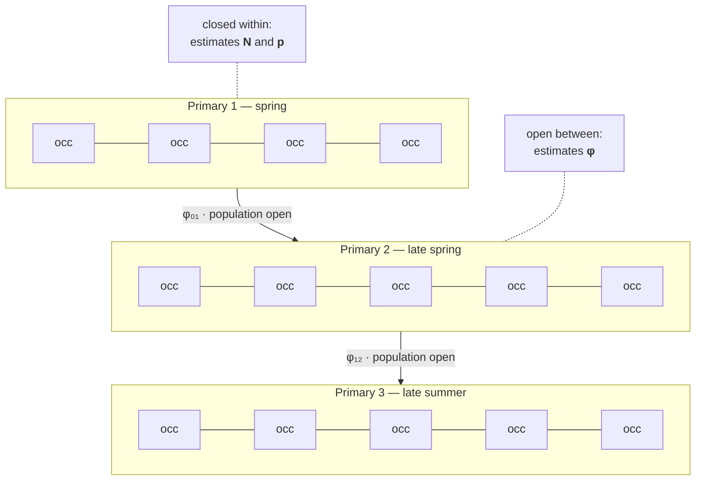

# Methods

The statistical workflow, and why each step is in it. Described at the level of method,
not result.

## Contents

- [The estimation problem](#the-estimation-problem)
- [The sampler](#the-sampler)
- [Priors](#priors)
- [The validation suite](#the-validation-suite)
- [Simulating the estimator's own bias](#simulating-the-estimators-own-bias)
- [Beyond the CMR: the other analyses](#beyond-the-cmr-the-other-analyses)
- [What the workflow refuses to do](#what-the-workflow-refuses-to-do)

---

## The estimation problem

You cannot count the population. You can only catch animals, mark them, and see which ones
you catch again.

Every capture record confounds two things: how many animals are there, and how likely you
are to detect one that is. A session with few captures could mean a small population or a
bad night. Separating them is what capture–mark–recapture does, and it does it by using
the pattern of recaptures across occasions.

The design is **Pollock's Robust Design**: primary sessions spread across a season, each
containing several secondary occasions close together in time.

The structure earns its complexity: **closed within a session** — no births, deaths or
movement over a few consecutive days — lets abundance and detection be separated. **Open
between sessions** — weeks apart — lets survival be estimated. One design, both classes of
parameter.

The estimated quantities are abundance per primary session, per-occasion detection
probability, and apparent survival between sessions. The word *apparent* is doing
essential work there; see [ADR-007](decisions/ADR-007-apparent-survival-is-not-survival.md).

## The sampler

Bayesian, with the sampler written directly rather than delegated: adaptive
Metropolis–Hastings, four chains, explicit warmup followed by the retained draws.
Convergence is reported per parameter as R̂ and effective sample size, and the posterior
summary — median, SD, 95% credible interval, R̂, ESS — ships with the package.

Writing the sampler was a deliberate choice over reaching for a probabilistic programming
framework. The model is small enough that the implementation is tractable, and
implementing the likelihood by hand forces every assumption of the design to become an
explicit line of code rather than a configuration option. See
[ADR-002](decisions/ADR-002-implement-then-cross-check.md).

The result is then **cross-checked against the maximum-likelihood equivalent** from an
established R package, with the exact call recorded in the script. Agreement between an
independently implemented Bayesian fit and a mature frequentist reference is meaningful
evidence that the implementation is correct — and it is evidence available only because
the two were computed by different code.

## Priors

Bayesian analysis is often criticised for prior choice, and usually the criticism lands
because the prior is undocumented.

Each prior here carries a comment naming the published estimate it derives from and
stating why it is deliberately broad. The reference available is an annual survival
estimate for a congeneric species — informative in kind, but on an **incommensurable
timescale** (annual versus a seven- to ten-week interval) and for an animal whose
burrowing life history differs. That reasoning is written down, so a reviewer can disagree
with it specifically rather than in general.

Then the influence is measured: the entire model is re-fitted under a deliberately
different prior family, and the results are compared. A prior-posterior **shrinkage**
diagnostic on the logit scale quantifies, per parameter, how much the data moved the
belief.

Together these answer the question a reviewer will ask — *how much of this conclusion is
your prior?* — with a number instead of a reassurance. See
[ADR-003](decisions/ADR-003-priors-justified-and-tested.md).

## The validation suite

A separate diagnostics module, run alongside the primary fit:

| Check | What it asks |
|---|---|
| **Posterior predictive check** | Does data simulated from the fitted model look like the data actually collected? |
| **Capture-frequency test** | Do individuals differ in catchability more than the model allows? |
| **Prior–posterior shrinkage** | How far did the data move each parameter from its prior? |
| **WAIC with standard error** | Model comparison, with the uncertainty of the comparison itself |
| **Alternative-prior re-fit** | How much do conclusions depend on the prior family? |
| **Closure test** | Is the within-session closure assumption defensible? |

Two of these deserve emphasis.

**The posterior predictive check** is the most honest question available to a Bayesian
workflow: simulate replicate datasets from the fitted posterior and ask whether the real
data would be unremarkable among them. A model can converge beautifully and still be
unable to reproduce the data it was fitted to.

**WAIC with a standard error**, rather than a bare WAIC. Model comparison by point
estimate invites treating a difference of one unit as meaningful. Carrying the standard
error of the difference is the same discipline as
[propagating uncertainty into a survey volume](https://github.com/nicolaskass/geospatial-data-processing):
a comparison without its uncertainty is not a comparison.

## Simulating the estimator's own bias

The strongest step in the workflow, and the one most often skipped.

Within-session closure requires that no animal leaves during the few days of a primary
session. For a frog that returns to underground refugia unpredictably, that assumption is
doubtful — and if it fails, abundance is not merely uncertain, it is *biased in a specific
direction*.

The usual treatment is a sentence in the discussion acknowledging the caveat.

Instead, a simulation generates data under varying degrees of within-session emigration,
runs the estimator on it, and produces a curve of how far the abundance estimate is pushed
as a function of assumption violation. The caveat becomes a magnitude.

The difference is what can honestly be claimed. "This assumption may be violated" leaves a
reader to guess whether that matters. A bias curve says how much it matters, and lets the
conclusion be stated with the right amount of confidence. See
[ADR-004](decisions/ADR-004-simulate-your-own-bias.md).

## Beyond the CMR: the other analyses

**Microhabitat selection** compares detections across three zones using quadrant sampling
with equal effort per zone, a contingency test between zones, and **bootstrap confidence
intervals with a fixed seed** for the selection proportions. Non-parametric methods
throughout — Mann–Whitney, Fisher's exact, Spearman — chosen because the sample sizes and
distributions do not support parametric assumptions, not because they are simpler.

**Morphometrics** includes recaptured individuals as a distinct data class, which is a
dependence structure that has to be handled rather than ignored.

Across all of them, figures are composed in the script that produced the numbers, with
serif typography and colour-blind-conscious palettes, so a figure cannot disagree with the
analysis that generated it.

## What the workflow refuses to do

- **It does not report a number without its uncertainty** — credible intervals throughout,
  and standard errors on model comparisons.
- **It does not call apparent survival "survival"**, because the model cannot separate
  mortality from permanent emigration.
- **It does not present a fit without checking it can reproduce the data**, via posterior
  predictive checks.
- **It does not treat a violated assumption as a footnote** when the bias can be
  simulated.
- **It does not let a reported number be typed by hand** into the manuscript.

Each refusal removes a way of being confidently wrong, which — under peer review, with
data that cost two field seasons — is the only failure that really costs anything.
